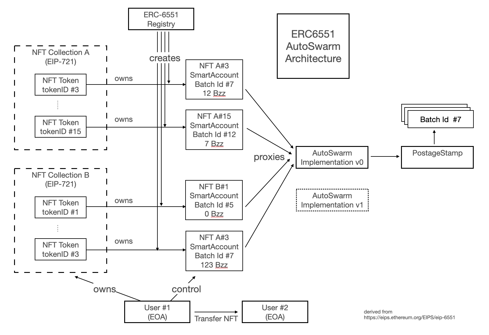

## AutoSwarm Proof of Concept (PoC)

## Objective

The objective of the AutoSwarm project is to ensure continuous availability of NFTs on Swarm, including storage of both metadata and content.
That means offering a onchain mean to pay for the storage of NFT...
as long as someone, at least, is interested in this NFT (creator, minter, owner, sponsor or any uneser)
and ready to pay a few amount, less than one dollar, to store it for more years.

## PoC

The specific goal of this subproject `AutoSwarm Proof of Concept`, is to demonstrate the feasibility of it,
thanks to an implementation of the new ERC6551 Token Bound Account (TBA) draft EIP standard.
That allows any NFT to store BZZ tokens and pay for Swarm storage when needed.

The architecture is as follows:

*A PDF slide presentation of the project can also be found [here](./docs/AutoSwarmPoC.pdf)*

## Demo

Demo is available on [this website](https://api.gateway.ethswarm.org/bzz/6dcec79a68194351716d89b69c5836f6ad96563f891ca06353c3781a33ed511a/) hosted on Swarm

This demo allows to TopUp a Swarm pre-minted NFT by one year.
The TopUp is made on the Batch of Stamps that includes the storage of this NFT.

A detailed page, gives more technical info on all smartcontracts involved and token exchanges during the TopUp.

## SetUp

To clone this demo, you have to manage 3 types of components:
1. SmarContracts with solidity/foundry
2. User Interface (UI) with typescript/sveltekit
3. Swarm local node with Bee client

### SmartContracts:
- prerequisite : foundry
- setup :
  - `forge build` or `forge test` to check building is ok
  - `forge script script/DeployAll.s.sol` to deploy smartcontracts

### UI:
- prerequisite : pnpm and node
- setup (on sveltekit directory):
  - `cd sveltekit && npm install` to install needed npm packages
  - `npm dev` to launch the UI

### Swarm node:
- easiest solution is to install [Swarm Desktop](https://www.ethswarm.org/build/desktop) but it will only install a lite Swarm node with limited fonctionnalities
- [install a full node](https://www.ethswarm.org/build/run-a-full-node) with Bee on your computer or on a server

With smartcontracts deployed, UI configured to reach you local node API, you will be able to interact with the PoC.
Be aware, as a PoC, it's functionnalities are limited, lot of parameters can't be modified.
More flexibility on next versions...

## Learning

Main learning from this PoC is that managing NFT content via one Batch of Stamps is inadequate. As many NFT can be attached to a batch NFT, topping
for one means topping for everybody. So stamps have to be managed at the unit level, Stamp by Stamp.

That's the purpose of next development to come.

## Aknowledgement

- [Swarm](https://www.ethswarm.org) is a decentralized file storage protocol.
Incentivized via the dedicated BZZ token available on the Ethereum network, and SmartContracts on the Gnosis chain
- AutoSwarm PoC is a project funded via a [Grant](https://www.ethswarm.org/grants) of the [Swarm Association](https://www.ethswarm.org)
- AutoSwarm is a projet developped by the [Kredeum](https://www.kredeum.com) company, that also develops the [Kredeum NFT Factory](https://github.com/Kredeum/kredeum):
that includes :
  - a [Dapp](https://app.kredeum.com) (deployed on multiple EVM chains) a NFT wallet, to display and interact with your NFTs,
  - a [Wordpress plugin](https://wordpress.org/plugins/kredeum-nfts/), the easiest way to mint, share and exchange NFTs on your website,
  - and the [OpenNFT library](https://github.com/Kredeum/OpenNFTs) of NFT dedicated SmartContracts.
- Previous Grants have been made with Swarm Association on the development on Swarm storage for the WordPress NFT plugin and the possibility to Mint WordPress article as NFT stored on Swarm
