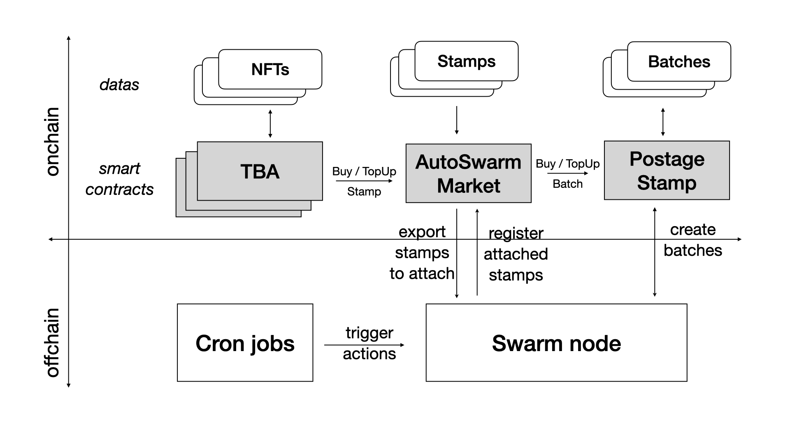
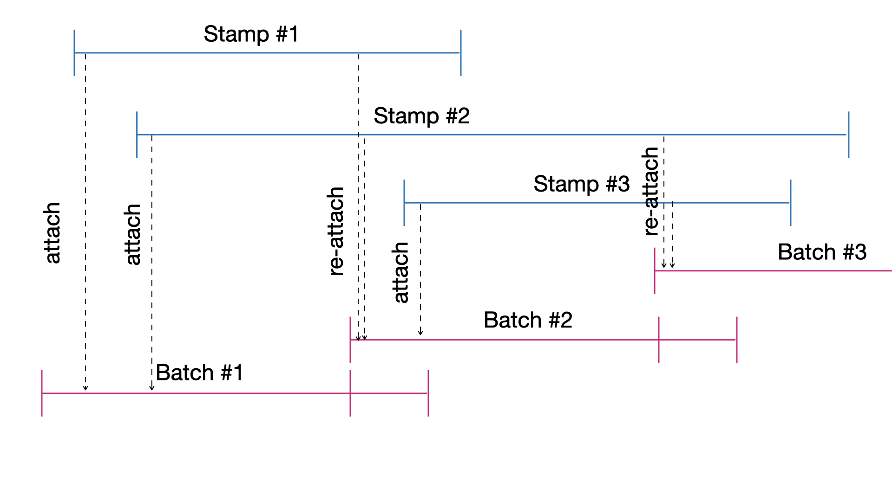

# AutoSwarm: NFT's Second Life
## _Swarm Backup, boosted by fan contributions_

---

# AutoSwarm: NFT's Second Life

_NFT are often stored on centralized storage, with no garantee of availability over time. Even with centralized storage, relying on an eternal sponsor or paying once for eternal storage, is both impratical and meaningless in a timeframe of 5, 10 or more years..._

### Swarm Backup
The __AutoSwarm ReSave__ button provides an easy Backup on Swarm of any NFT, preserving both metadata and content, to ensure NFT availability over time.

### Boosted by Fan contributions
With the __AutoSwarm TopUp__ button, storage duration extends as long as there are still supportive individuals – be it the creator, owner, a sponsor, or any users – willing to contribute Bzz donations, ensuring the sustained life of your NFTs.

---

# AutoSwarm Dapp

___AutoSwarm Dapp__ is a one-page service, envisioned as a Public Good, supported by the Web3 community_

__AutoSwarm Dapp__ allows to __ReSave__ and __TopUp__ NFTs on Swarm.

Direct access to a specific NFT is possible via the url address (specifying Chain Id, Collection Address and Token Id)

_Direct link is available possible via [Kredeum NFTs Factory](https://beta.kredeum.com) Share button. That allows to select any of your own NFTs then link to the related AutoSwarm page_

---

# AutoSwarm SmartContracts

### AutoSwarm Account
Thanks to new __ERC6561__  proposal, any NFT can own tokens, via a Token Bound Account (__TBA__), a dedicated `AutoSwarmAccount` smartcontract linked to the NFT. After transfer of the NFT, these tokens are still linked to the NFT, at the disposal of the new NFT owner.

### AutoSwarm Market

So, anyone can send  Bzz tokens to the TBA of the NFT they want to extends lifetime. Then, thanks to AutoSwarm solution, `AutoSwarmMarket` smartcontract can pay Swarm Protocol via `PostageStamp` smartcontract to TopUp NFT storage when needed.

---

# AutoSwarm Architecture
<!-- _footer: "" -->

---

# AutoSwarm Market
__AutoSwarm Market__ extends the capabilites of the __Swarm PostageStamp__:
- __PostageStamp__ managing Batch of Stamps with Depth and TTL in a wholesale approach
- __AutoSwarm Market__ managing Stamps with Size and TTL, in a retail approach, mirroring __PostageStamp__ internal mechanisms... at a smaller scale

__AutoSwarm Market__ has been designed to ReSave and TopUp NFTs one by one, that means, most of the time, small amount of data.

Not limited to NFTs, __AutoSwarm Market__ can also be used as well, for any kind of data, to Backup and TopUp on Swarm.

---

# Batchs & Stamps - Properties

Core __AutoSwarm__ architecture is about __Batchs__ and __Stamps__ properties and interactions:

- One Stamp per NFT, including NFT metadata and content (and possibly other assets)
- One Year Stamp by default (365 days precisely),
- One Month Batch by default (30 days precisely)
- One Week overlapping time between two Batches (7 days)
- One Batch exists at a time (or Two Batchs during overlapping period)
- Stamps are attached to One Batch (or possibly Two Batchs during overlapping time)
- Stamps use same remaining balance mechanism as `PostageStamp` Batchs, with size and ttl instead of depth and ttl

---

# Batchs & Stamps - BackOffice (1/2)

Stamps and Batch managed by 2 Crons, that may run periodicaly or triggered when ReSaving or TopUping. These Crons are currently centralized and managed by AutoSwarm Team, but should later evolves as a fully decentralized protocol.

### Daily Cron button :
1. list all NFTs to ReSave since last Daily Cron
2. Checks their Size and Swarm Hash with a dedicated Swarm node
3. Transfer payment of the Stamp from the TBA to the Market
4. Attach the Stamp with the current Batch of the market (mapping StampId to BatchId).

---

# Batchs & Stamps - BackOffice (2/2)

### Monthly Cron
launch, roughtly every month, at the beginning of the overlapping period
1. Buy a new Batch
2. List all active Stamps (that expired after the end of overlapping period)
3. Re-attach selected Stamps to new Batch (both on the Swarm Node and on the AutoSwarm smartcontracts)

---
<!-- _footer: "" -->
#  Batchs & Stamps - Timeline

---

# RoadMap

### Q1 2024
- Launch trial with beta users

### Q2 2024
- V1 launch on production
- Integration of AutoSwarm with Swarm Desktop

### Q2-Q4 2024
- Full Decentralization of AutoSwarm, mainly BackOffice

---

# @Kredeum

www  https://www.kredeum.com

dapp https://app.kredeum.com

email contact@kredeum.com

x https://x.com/kredeum

github https://discord.gg/Vz5AyU2Nfx

