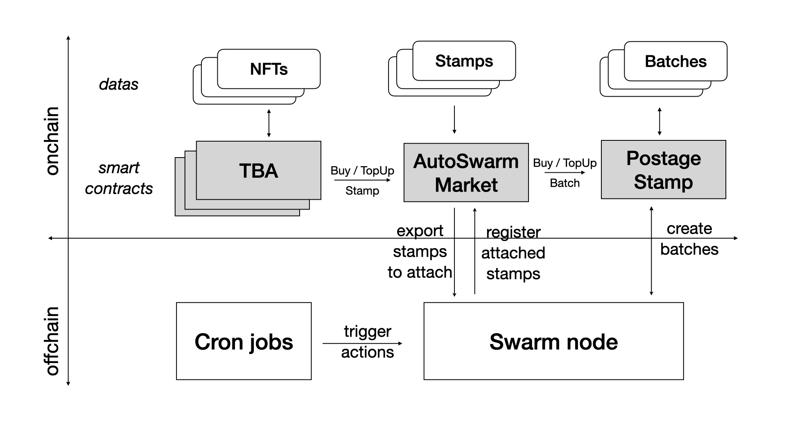

# AutoSwarm NFTs Stamper (2/3)

## _Empowering Eternal Digital Ownership_

&nbsp;

&nbsp;

### 7th November 2023

---
# AutoSwarm Schedule (3 grants)

### 1/3 : AutoSwarm PoC (done)
AutoSwarm demo via One Page example : Topping Up an existing NFT by One year.

## 2/3 : AutoSwarm Stamper (this grant)
PoC prooved the need to manage Stamps one by one, this is the purpose of this development, results in same demo with Stamp TopUp instead of Batch TopUp

### 3/3 : AutoSwarm ReSaver (next)
To be able to manage -- to AutoSwarm -- whatever NFTs, this means re-store on Swarm any existing NFTs, to be able then  to ToPup them

---
# Architecture decisions :

- One Stamp per NFT, containing NFT metadata and content and maybe other assets
- One Year Stamp by default (365 days precisely),
- One Month Batch by default (30 days precisely)
- One Week overlapping time between two Batches (7 days)
- Stamps attached to one Batch (two during overlapping time), changed during overlapping period (if Stamp not expired)
- One Batch at a time (or two during overlapping period)
- Stamps use same remaining balance mechanism as Batches, but with size and ttl, instead of depth and ttl

---

# PostageStamp vs AutoSwarm Market

## PostageStamp : _manage Batch of Stamps with depth and ttl_
- topUp Batch => more ttl / same depth
- dilute Batch =>  more depth / less ttl
- extends Batch _added_ => more depth / same ttl

## AutoSwarm Market : _manage Stamps with size and ttl_
- topUp Stamp => for immutable NFT / fixed size
- extends Stamp _later_, for mutable NFT or any other useCase, any Swarm file

---

# AutoSwarm Architecture
<!-- _footer: "" -->

---

#  AutoSwarm Stamp Creation Workflow

0. Offchain : **Choose NFT**
1. Onchain : **Create TBA**  (NFT Token Bound Created TBA)
2. Onchain : **Send Bzz** to TBA
3. Onchain : **TopUp NFT** => creates a Stamp to store NFT metadata
4. Offchain : **Attach Stamp** to the Batch on a Swarm node
5. Onchain : **Register Stamp** on this Batchid after attachement

---

#  AutoSwarm Stamps & Batch Timeline (1/2)

1. Offchain : **Create new Batch** on a Swarm node
2. Onchain : **Register Batch** on AutoSwarm Market
3. Onchain : **Export Stamps** to attach from AutoSwarm Market
4. Offchain : **Attach Stamps** (not expiring) Stamps  to the new Batch on a Swarm node
5. Onchain : **Register Stamps** on this Batchid after attachement
6. Offchain : **Wait** one month
7. Offchain : **Back to 1.**

---
<!-- _footer: "" -->
#  AutoSwarm Stamps & Batch Timeline (2/2)

---

#  Onchain : AutoSwarm Market Smartcontract

## Done
- 3 versions to get the final working one, with Architecture decisions
- similar mechanism than PostageStamp

## ToDo
- use same sorted list mechanism
- security audits
- tests with real users (on testnet)

---

# Offchain : AutoSwarm scripts and cron

## Done
- One time manual attachment of Stamp

## ToDo :
- offchain attachment of Stamps to batches : to be done within AutoSwarm Re-Saver : same scripts to develop
- cron jobs :
  - one each day to trigger attachement on new Stamps,
  - one each month to trigger re-attachement on new Batch
