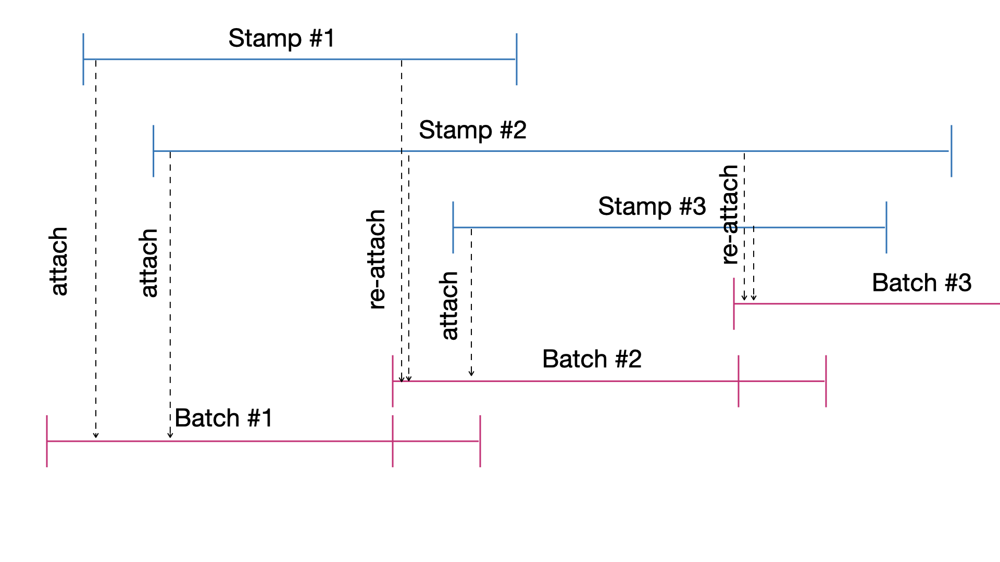

# AutoSwarm NFTs ReSaver (3/3)

## _Empowering Eternal Digital Ownership_

&nbsp;
&nbsp;

### 28th November 2023
_Intermediate Report_

---

# Agenda

1. AutoSwarm ReSaver:
Architecture description (slides follows) / intermediate demo
1. AutoSwarm economics:
Fully decentralized protocol / Public Good by Swarm /
Service Run by DAO / Propriatary Paid Service
1. Swarm Communication in Rennes (and more broadly in France ?)
Talk on AutoSwarm at our next local meeting on 12th december. We will search for people to organize meeting, dev also ?
Early 2024 a dedicated  meeting on Swarm ?

---

# AutoSwarm Architecture
<!-- _footer: "" -->

---

#  AutoSwarm User Workflow
**ReSave**

0. OffChain : **Choose NFT** - from link, from Kredeum Dapp
0. OffChain : **ReSave NFT** - ReSave NFT metadata and content on Swarm
0. OnChain : **Send 0.1 Bzz** - send to TBA
0. OnChain : **Create TBA**  - NFT Token Bound Account (TBA) created
0. OnChain : **TopUp NFT** - add 1 year to NFT Swarm storage

**TopUp**

1. OnChain : **Send 0.1 Bzz** - send to TBA
1. OnChain : **TopUp NFT** - add 1 year to NFT Swarm storage

---
<!-- _footer: "" -->
#  AutoSwarm Stamps & Batch Timeline

---

#  AutoSwarm Service Workflow

**Monthly Cron**

1. OffChain : **Create new Batch** on a Swarm node
1. OnChain : **Register Batch** on AutoSwarm Market as current Batch

**Dayly Cron**

1. OnChain : **Export Stamps** to attach from AutoSwarm Market
1. OffChain : **Attach Stamps** not expiring) to the new Batch on a Swarm node
1. OnChain : **Register Stamps** on this Batchid after attachement

---

#  Demo

---

#  _Next meeting with final demo : 8 th december ?_

